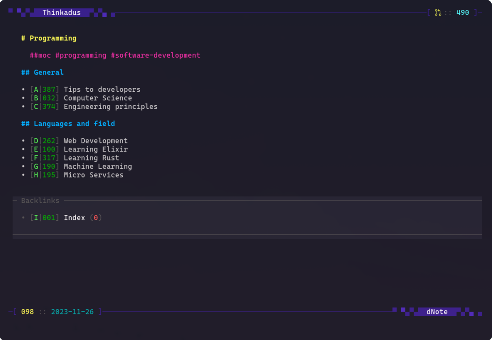

# dnote

A terminal based notes application using Markdown files and wikilinks to link
notes. It has a TUI for browsing the notes and a CLI for interacting with them
as commands.

dNote does not support editing directly but work together with an external
editor. When used with another terminal editor the suggestion is to use either a
terminal multiplexer (like tmux) or open a new terminal with the editor.

## Features

- Notes have three digit IDs to make them easy to remember and type in when
opening by ID.
- Links have uppercase shortcuts to make navigation fast.
- Full keyboard navigation
- Fuzzy and full text search
- Git commit/sync 
- Lightweight inbox support 

## Keyboard shortcuts

- `a`: add (write title)
- `e`: edit current not
- `j`: scroll down
- `k`: scroll up
- `ctrl-d`: page down
- `ctrl-u`: page up
- `g`: git commit
- `alt-g`: git sync
- `l`: goto last note
- `/`: search in files
- `r`: refresh notes
- `]`: next note
- `[`: previous note
- `i`: add to inbox
- `ctrl-i`: navigate forward
- `ctrl-o`: navigate back
- `ctrl-n`: jump to next link
- `ctrl-p`: jump to previous link

## Requirements

dNote makes use of [ugrep](https://github.com/Genivia/ugrep) for searching.

## Setup
Copy ./dnote.yaml.example to ~/.config/dnote.yaml and edit it to work for your setup.

Set the environmental variable `DNOTES` to point at the directory of your notes
(adding a default notes directory to settings is planned, [#3]).

